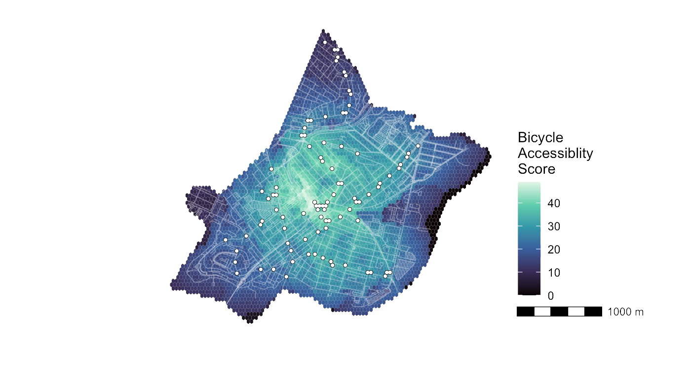
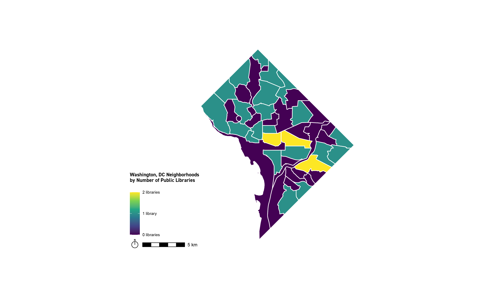
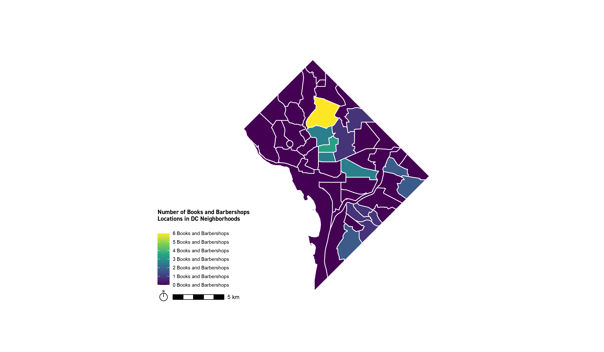

```{r setup, include=FALSE}
knitr::opts_chunk$set(echo = TRUE)
```

<style>
body {
text-align: justify}
</style>

<style>
body {
font-family: arial}
</style>

# introduction

[](https://mike-lid.github.io/folio/fullsize/focus.pdf){target="_blank"}
\superscript^*__Fig.01___Overview of Cities Studied (Lidwin via the Buckminster Fuller Institute, 2021)*^


\superscript^*Lucy Fellowes once  said, __"Every map is someone’s way of getting you to look at the world his or her  way."__ (Lucy  Fellowes,  Smithsonian  curator,  quoted  in  Henrikson  1994 and in Kitchin, Perkins, and Dodge 2009). This course is my first formal class on map-making, and I've enjoyed thinking about the lense I inevitably communicate when visualizing various urban phenomena. Throughout this semester, I used R Studio and ArcGIS to develop a small breathe of maps, considering  how these visualizations begin to reveal (and exclude) information about the cities studied. Each week, I spent time looking at different cities across the world, so that I can get an idea of how data availability differs between major global cities. *^

<center>
<p style="font-family: times, serif; font-size:13pt; font-style:italic">
    **"The aim of the grammar is to 'bring together in a coherent way things that previouslyappeared unrelated and which also will provide a basis for dealing systematically with newsituations' (Cox 1978). How well have we succeeded?" - H. Wickham, _A Layered Grammar of Graphics_, 2010**
</p>
</center>

\superscript^*The following portfolio demonstrates a variety of skills learned while developing my grammar for data visualization. This includes:*^ 

|        \superscript^*- displaying multiple vector layers on the same map*^  
|        \superscript^*- calculating and displaying relationships among point and polygon layers based on distance*^  
|        \superscript^*- aggregating point data to a layer of polygons*^  
|        \superscript^*- calculating and displaying accessibility, based on travel time*^  
|        \superscript^*- converting between raster layers and vector layers*^  
|        \superscript^*- displaying raster data on a map*^  
|        \superscript^*- georeferencing a raster image*^  
|        \superscript^*- displaying data on an interactive map*^  

# **GREATER BOSTON, MA**
\superscript^*I studied two areas of the Great Boston Region this semester: 1) the City of Chelsea and 2) Middlesex County. The investigations in these cities varied - from looking at the influence of higher education institutions on household type to analyzing green space access.*^


## **Household Type in Middlesex County (interactive) **
According to the 2015 - 2019 American Community Survey, 28.5% of the population in Cambridge are students enrolled in college or graduate school programs. (Source: City of Cambridge Community Development Department, 2021). I wonder what effect the student population has on the family type in Cambridge and whether Cambridge will have more nonfamily household types than other areas of Middlesex County. For the following map, I referenced census data for household type. I am making the assumption that those in higher education will be more likely to fill out the voluntary ACS, so there may be confirmation bias in a map that only references this data. Therefore, I am using the census data in hopes of getting a more complete picture. 

* Displaying data on an interactive map

[](https://mike-lid.github.io/folio/fullsize/LIDWIN_Week6_InteractiveMap.html){target="_blank"}
\superscript^*__Fig.02___Week 6 Assignment (Lidwin, 2021)*^

## **Walkability in Chelsea**
In a 2012 presentation on Chelsea's environmental justice issues, GreenRoots presented data that Chelsea has some of the fewest amount of green spaces/parks per square mile in the Boston Metro Area. My group was interested in studying how accessible Chelsea's parks are to their residents. Thus, the following maps investigated walking distances to the nearest parks, as well as overall biking accessibilty. (Source: Aren Kabarajian, “Detox: GreenRoots’ Fight for Environmental Justice in Chelsea,” December 2017.)

This isocrone map shows isochrones based on travel time to the nearest park. It features the following skills:

* Displaying multiple vector layers on the same map
* Calculating and displaying accessibility, based on travel time

[](https://mike-lid.github.io/folio/fullsize/a_chelsea_isocrone.pdf){target="_blank"}
\superscript^*__Fig.03___Week 4 Assignment (Khinda, Lidwin, Montoya, 2021)*^


## **Accessibility for Biking**
This map shows overall accessibility rankings based on a distance-decay function of the biking time to the nearest transit stop. It demonstrates the following skills:

* Displaying multiple vector layers on the same map
* Calculating and displaying accessibility, based on travel time
* Displaying raster data on a map

[](https://mike-lid.github.io/folio/fullsize/accessibility.pdf){target="_blank"}
\superscript^*__Fig.04___Week 5 Assignment (Khinda, Lidwin, Montoya, 2021)*^


# **VENICE, ITALY**
\superscript^*Our group created a series of maps documenting the impact of flooding across the city of Venice. As our maps reveal, the buildings of the city that would be most impacted by 1 meter of flooding are located in the oldest neighborhoods, including some of Venice’s most notable landmarks like the Piazza San Marco. Newer landmasses added to the city are higher and seem to be built up with flooding in mind.*^
   
\superscript^*__Fun fact__: We stitched together the base-map from eight individual maps that were part of the Harvard Map Library. In fact, the series of maps were originally found in the GSD building and donated to the Map Library. We were excited to return this map to the GSD, in a way, through this project.*^


## **Flood Projections for Venice**
This map demonstrates the following skills:

* Georeferencing a raster image
* Convert between raster and vector images (created vector cohntour outlines of rasterized data for flood areas in order to group similar areas together)

[](https://mike-lid.github.io/folio/fullsize/georeference.pdf){target="_blank"}
\superscript^*__Fig.05___Week 2 Assignment (Jamal, Lidwin, McGlinchey, Prasad, 2021)*^


# **WASHINGTON, DC**
\superscript^*I studied Washington, DC with my group for Assignment 3 - comparing the presense of a new "Books and Barbershops programs" with the location of existing public libraries in the city. The goal was to assess if this particular program (which seeks to host learning and literacy programs inside local barbershops) was particularly over-or-under-represented in certain neighborhoods. Thus, we analyzed the amount of point data within polygon datasets.*^

## **Neighborhoods x Libraries**

Before comparing neighborhoods that contained Barbershop & Book locations, we first wanted to see how many libraries existed in each neighborhood.  We used this data as a rough, and likely inaccurate, indication of whether a neighborhood had access to educational and learning-based programs. While several neighborhoods had at least one library, the areas with 2 libraries indicate libraries of the Smithsonian Institute. The Southeast area, compared to the northern area in DC, had  the least amount of neighborhood clusters with libraries - 6 neighborhood cluster areas had no public library within their boundary.

This map demonstrates:

* aggregating point data to a layer of polygons
* calculating and displaying relationships of point and polygon data

[](https://mike-lid.github.io/folio/fullsize/dc-libraries.pdf){target="_blank"}
\superscript^*__Fig.06___Week 3 Assignment (Bonanno, Lidwin, Myros 2021)*^

## **Neighborhoods x B&B Sites**

[](https://mike-lid.github.io/folio/fullsize/dc-bb.pdf){target="_blank"}
\superscript^*__Fig.07___Week 3 Assignment (Bonanno, Lidwin, Myros 2021)*^

---
\superscript^*_The above maps were completed for the Spatial Analysis course, led by Dr. Carole Voulgaris (Fall 2021). They represent an understanding of software and visualization techniques learned through course lectures, software tutorials, and group discussions._*^


