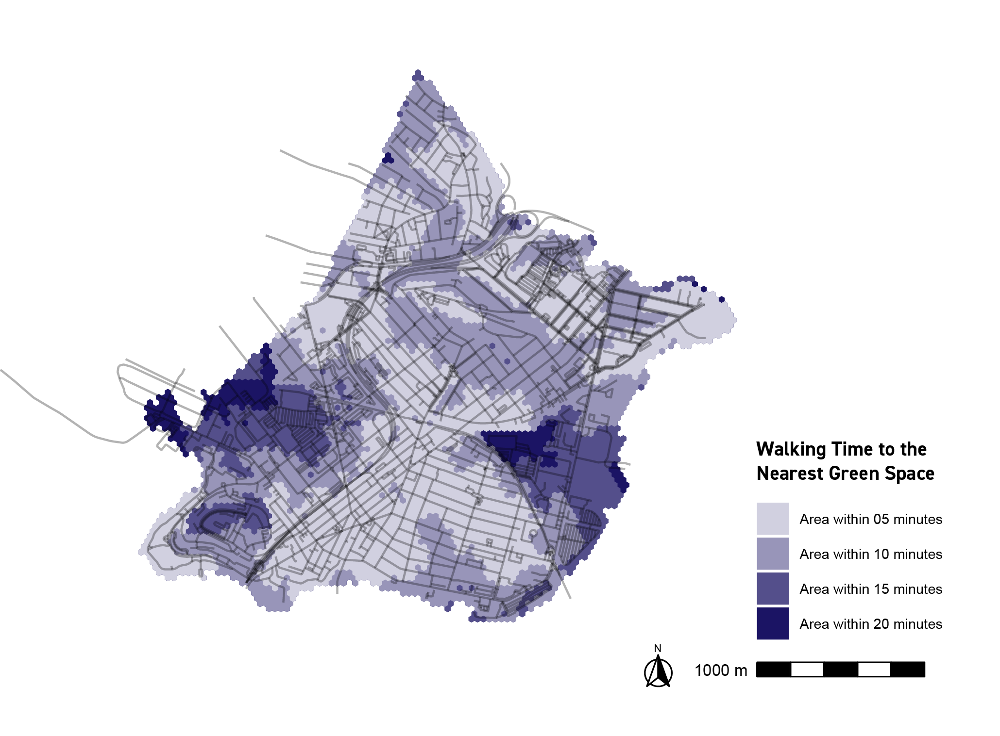

```{r setup, include=FALSE}
knitr::opts_chunk$set(echo = TRUE)
```

<style>
body {
text-align: justify}
</style>

<style>
body {
font-family: arial}
</style>

# introduction
\superscript^*Lucy Fellowes once  said, __"Every map is someone’s way of getting you to look at the world his or her  way."__ (Lucy  Fellowes,  Smithsonian  curator,  quoted  in  Henrikson  1994 and in Kitchin, Perkins, and Dodge 2009). This course is my first formal class on map-making, and I've enjoyed thinking about my bias in visualizing various urban phenomena. Throughout this semester, I used R Studio and ArcGIS to develop a small breathe of maps, considering  how these visualizations begin to reveal (and exclude) information about the cities studied. Each week, I spent time looking at different cities across the world, so that I can get an idea of how data availability differs between major global cities. *^

<center>
<p style="font-family: times, serif; font-size:13pt; font-style:italic">
    **Why did we use these specific parameters during the calculation of the fingerprints?**
</p>
</center>

\superscript^*The following portfolio demonstrates a variety of skills, including:*^ 

|        \superscript^*- displaying multiple vector layers on the same map*^  
|        \superscript^*- calculating and displaying relationships among point and polygon layers based on distance*^  
|        \superscript^*- aggregating point data to a layer of polygons*^  
|        \superscript^*- calculating and displaying accessibility, based on travel time*^  
|        \superscript^*- converting between raster layers and vector layers*^  
|        \superscript^*- displaying raster data on a map*^  
|        \superscript^*- georeferencing a raster image*^  
|        \superscript^*- displaying data on an interactive map*^  

# **GREATER BOSTON, MA**
Here are two maps of Chelsea. I might include some text here about this set of maps.

## **Interactive Map**
This interactive map demonstrates the following skills: 

* Displaying data on an interactive map

[](https://mike-lid.github.io/folio/fullsize/LIDWIN_Week6_InteractiveMap.html){target="_blank"}
\superscript^*__Fig.02___Week 6 Assignment (Lidwin, 2021)*^

## **Isochrones**
This map shows isochrones based on transit travel times to the nearest school. It demonstrates the following skills:

* Displaying multiple vector layers on the same map
* Calculating and displaying accessibility, based on travel time

[](https://mike-lid.github.io/folio/fullsize/a_chelsea_isocrone.pdf){target="_blank"}
\superscript^*__Fig.03___Week 4 Assignment (Khinda, Lidwin, Montoya, 2021)*^


## **Accessibility**
This map shows accessibility based on a distance-decay function of the walking time to the nearest transit stop. It demonstrates the following skills:

* Displaying multiple vector layers on the same map
* Calculating and displaying accessibility, based on travel time
* Displaying raster data on a map

[](https://mike-lid.github.io/folio/fullsize/map8.jpg){target="_blank"}
\superscript^*__Fig.04___Week 5 Assignment (Khinda, Lidwin, Montoya, 2021)*^


# **VENICE, ITALY**
Here are two maps of Chelsea. I might include some text here about this set of maps.

## **Clockboard Map**
This map demonstrates the following skills:

* Aggregating point data to a layer of polygons

[](https://mike-lid.github.io/folio/fullsize/clockboard.pdf){target="_blank"}

# **WASHINGTON, DC**
Here are two maps of San Luis Obispo, California. I might include some text here as well.


